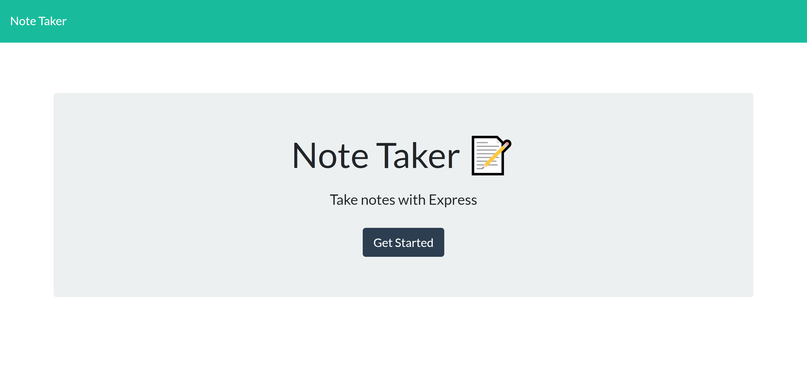
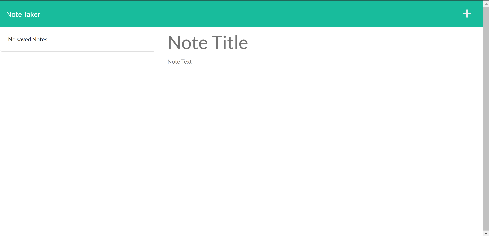

# 11 Express.js: Note Taker

## Description

Modify starter code to create a **Note Taker** application that can be used to write and save notes. This application will use an **Express.js** back end and will save and retrieve note data from a **JSON** file. The application should be deployed to and run from Heroku.

## User Story

```
AS A small business owner
I WANT to be able to write and save notes
SO THAT I can organize my thoughts and keep track of tasks I need to complete
```

## Acceptance Criteria

```
GIVEN a note-taking application
WHEN I open the Note Taker
THEN I am presented with a landing page with a link to a notes page
WHEN I click on the link to the notes page
THEN I am presented with a page with existing notes listed in the left-hand column, plus empty fields to enter a new note title and the note’s text in the right-hand column
WHEN I enter a new note title and the note’s text
THEN a Save icon appears in the navigation at the top of the page
WHEN I click on the Save icon
THEN the new note I have entered is saved and appears in the left-hand column with the other existing notes
WHEN I click on an existing note in the list in the left-hand column
THEN that note appears in the right-hand column
WHEN I click on the Write icon in the navigation at the top of the page
THEN I am presented with empty fields to enter a new note title and the note’s text in the right-hand column
```

## Table of Contents

- [Installation](#installation)
- [Usage](#usage)
- [License](#license)

## Installation

This application requires **Node.js** JavaScript Runtime and **Express.js** package. Basic knowledge of [Node.js](https://nodejs.org/en/) and [Express.js](https://expressjs.com/) is recommended to run the application. To faciliate the installation and run of the application, a _package.json_ file is provided with the project along with basic instructions of how to install the required libraries:

```bash
npm i express
```

Other libraries required include [Uniqid.js](https://www.npmjs.com/package/uniqid), a library to "create unique id's based on the current time, process and machine name."

```bash
npm i uniqid
```

This library is used to give each note a unique identifier.

## Usage

The application is invoked by using the following command:

```bash
node server.js
```

Next, open up your browser and enter **http://localhost:8080/** in the addess bar; the main page opens up:



click or tap the _Get Started_ button. The note-taking page opens up:



You can also run the application hosted in Heroku by following this link:

https://ku-cbc-homework-11-note-taker.herokuapp.com/

The application shows all the notes saved to the database file (a _JSON_ file) in the left-hand panel. A new note can be added by entering the title and text in the right-hand panel. After entering the title and text, the **Save** button is enabled, which allows the user to save the note to the database. The new note appears in the left-hand panel along with the previously saved notes.

Existing notes can be deleted by clicking the **Delete** button.

A link to a walkthrough video demonstrating the application functionality is provided [here](https://drive.google.com/file/d/1C78ZRwOAJkPUPp96jouGpzFw-bIt1IXp/view). In addition, a video demonstrating how to test the application is provided [here](https://drive.google.com/file/d/130wfX9qfxNKQa8vcTvxbt3pc2eJsWXZa/view).

If you want to cancel the application execution while running it locally, press the following command in Microsoft Windows, or equivalent commands in Mac OS and Linux:

```bash
CTRL + C
```

## License

This project is licensed under The MIT License. Refer to https://opensource.org/licenses/MIT for more information of what you can and cannot do with this project. See contact information below if you have questions, comments, or suggestions for the project.

## Contributing Guidelines

Want to contribute to this project? You may clone or fork the project in GitHub. Note the licesing information referred in this file.

## Contact Information

For questions, comments, or suggestions, please contact me by E-Mail:

japinell@yahoo.com

Check out my other **cool** projects in GitHub - https://github.com/japinell

## License

This application is licensed under the following license:

[](https://opensource.org/licenses/MIT)(https://opensource.org/licenses/MIT)
